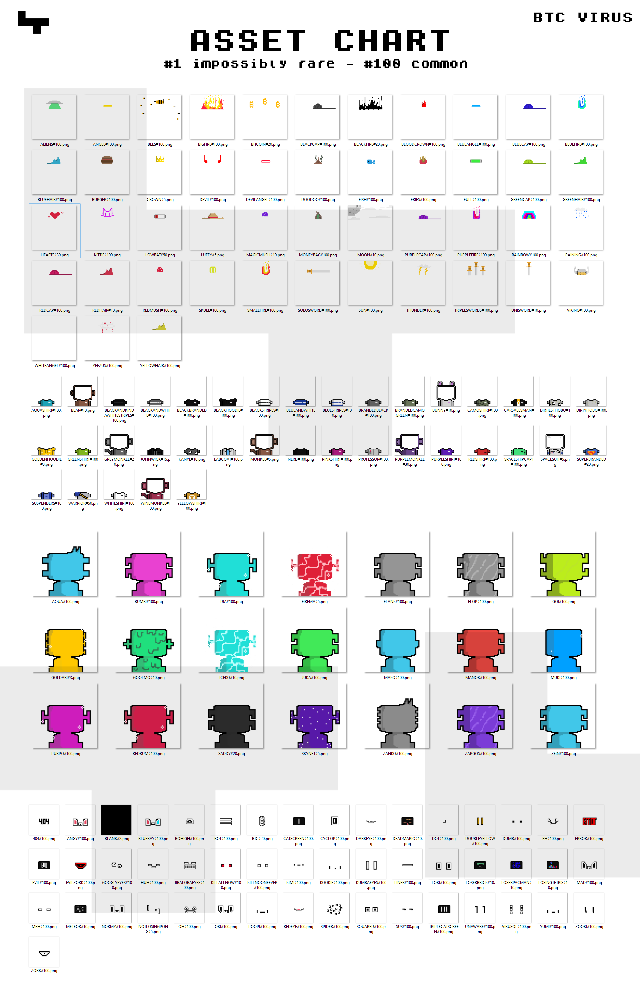

# BTC Virus

Airdrop BTC Machine & BTC Operators holders\
Supply 10K

Rarity Image: 

Rarity pdf:&#x20;



BTC VIRUS is our largest collection to date. Part of our exclusive ecosystem, BTC VIRUS is a doorway for the entire Ordiverse to participate in our brand and products.

This collection was the biggest airdrop in the history of Ordinals, 10 000 free airdrops to the entire Ordiverse, literally. They infected the wallets of the top 60 projects.

Owning a BTC VIRUS gives you access to exclusive partnerships, events, and a plethora of goodies.

All and all, owning a Virus guarantees that you will have a hell of a good time in both our ecosystem and the Ordiverse!
